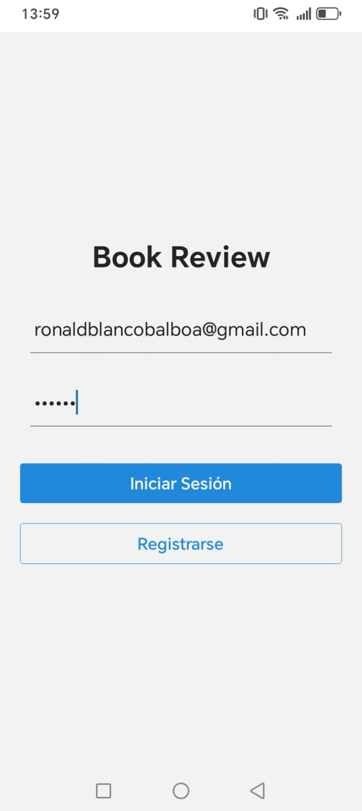
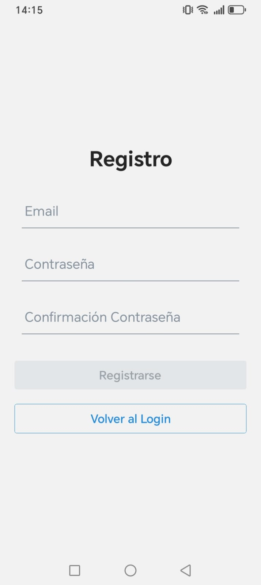
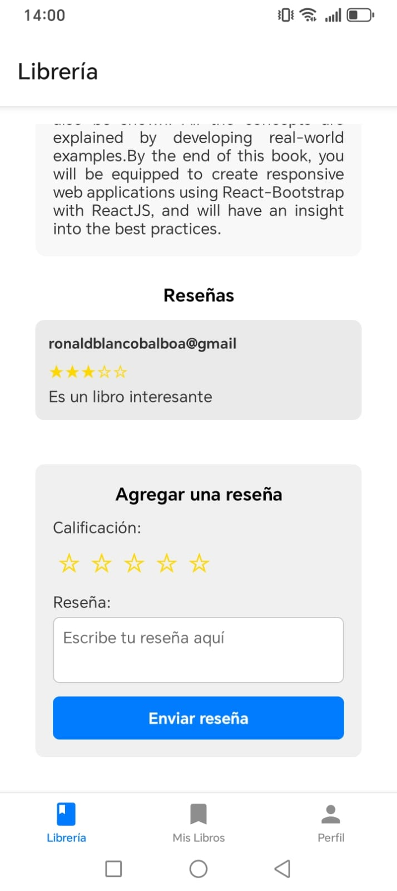

## Instrucciones de instalación

- Una vez que se tenga el repositorio en local, ejecutar en consola el siguiente comando

```
npm i
```

- Para correr el proyecto ejecutar en consola el siguiente comando

```
npx expo start
```

## Funcionalidades

- Crear cuenta - Registrarse
- Iniciar sesión - Login
- Ver libros
- Ver más información de cada libro
- Elegir libro favorito
- Añadir reseña de libro
- Añadir calificación
- Ver reseñas
- Cerrar sesión

## Capturas de pantalla







